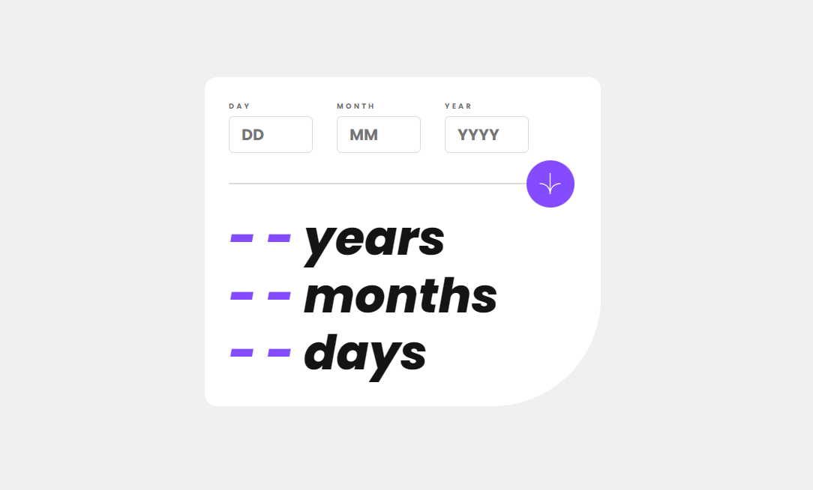

# Age Calculator 

I created an Age Calculator app as part of the [Frontend Mentor](https://www.frontendmentor.io/challenges/age-calculator-app-dF9DFFpj-Q) challenge. This app helps users to calculate their age based on their birthdate.

## Features

- Calculates users age based on their birthdate.
- Responsive design, suitable for various screen sizes.

## Technologies Used

- HTML
- CSS
- JavaScript

## Usage

1. Enter your birthdate in the provided input field.
2. Click the Arrow button or press Enter to see your age displayed.

## Acknowledgments

- [Frontend Mentor](https://www.frontendmentor.io/) for the challenge

